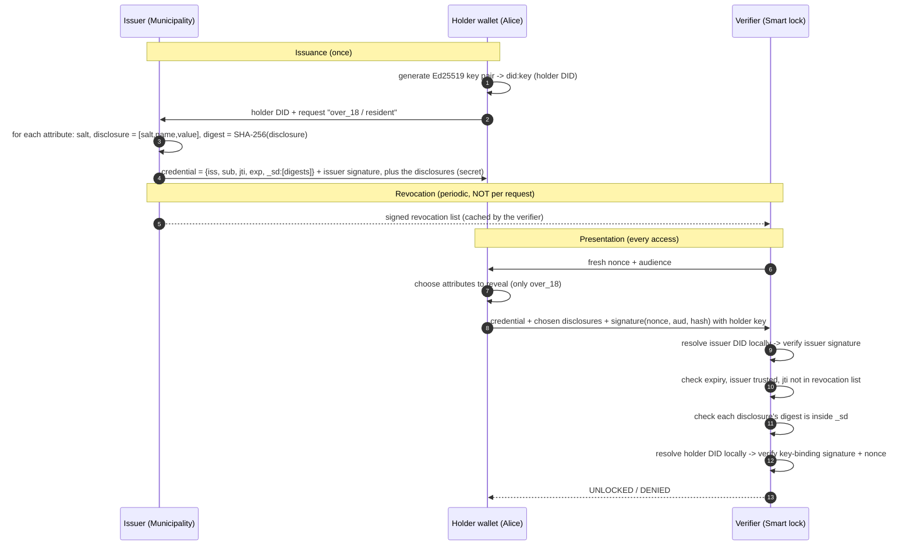

# Credential exchange - sequence diagram

```mermaid
sequenceDiagram
    autonumber
    participant I as Issuer (Municipality)
    participant H as Holder wallet (Alice)
    participant V as Verifier (Smart lock)

    Note over I,H: Issuance (once)
    H->>H: generate Ed25519 key pair -> did:key (holder DID)
    H->>I: holder DID + request "over_18 / resident"
    I->>I: for each attribute: salt, disclosure = [salt,name,value], digest = SHA-256(disclosure)
    I->>H: credential = {iss, sub, jti, exp, _sd:[digests]} + issuer signature, plus the disclosures (secret)

    Note over I,V: Revocation (periodic, NOT per request)
    I-->>V: signed revocation list (cached by the verifier)

    Note over H,V: Presentation (every access)
    V->>H: fresh nonce + audience
    H->>H: choose attributes to reveal (only over_18)
    H->>V: credential + chosen disclosures + signature(nonce, aud, hash) with holder key
    V->>V: resolve issuer DID locally -> verify issuer signature
    V->>V: check expiry, issuer trusted, jti not in revocation list
    V->>V: check each disclosure's digest is inside _sd
    V->>V: resolve holder DID locally -> verify key-binding signature + nonce
    V-->>H: UNLOCKED / DENIED
```
